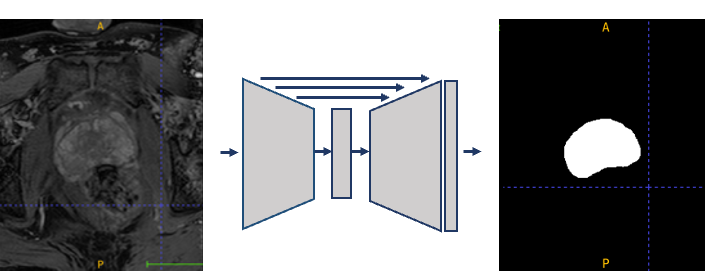

# 8DM20: Capita selecta in medical image analysis

## Additional project background

An alternative approach for automatic segmentation, which does not require registration, is via pixel-based classification. Here the delineated patient images form the training set, and each pixel is a sample, labeled as either foreground (organ of interest) or background. 
The training set is used to train a classifier which predicts for each pixel of the input image whether it is foreground or background. A common approach is to use a deep learning model such as a U-Net, demonstrated in Figure 1.

*Figure 1: a schematic of a U-Net model, taking the prostate MR image as input and outputting the binary segmentation mask.*

However, for training, it is important to have a large training set, and in practice this may not always be available. A large dataset is not available in this case. A recent idea to tackle this problem is to train deep generative models to generate _synthetic_ training data. These synthetic images can then be used along with the real images in order to train the segmentation model.

## Task

Train a generative model to create synthetic images and investigate whether the use of these images improves the training of the segmentation model. (Think of a suitable metric to compare segmentation performance with and without synthetic data).

## Practical aspects

### Practical session

To get you started with the project, in the practical session, you will train: 
1. A segmentation model based on the U-Net.
2. A VAE model to generate synthetic data. This will serve as a baseline generative model in the "project" part of this course. 

<!-- The practical session will introduce a segmentation model based on the U-Net and a baseline VAE implementation. -->
You won't implement the models from scratch. The outline of the code is already given (have a look around the files in the folder `code`). The parts that you will implement are indicated with `# TODO`. 
First, you will implement the segmentation model. To do this, start from `train_seg.py`. Once you can  train the segmentation model, move on to the VAE.
Note that the model architecture is designed to process 2D images, i.e., each slice is segmented individually. To save computation time, the images are downsampled during loading (this is already implemented).  

### Project

For your project, you are free to build on top of the practical session or to use a different approach. Remember the discussion from the lecture on the limitations of VAEs and potential solutions to this. Since the focus of this part of the course is on generative models, it is recommended to spend time optimising the gernerative model rather than the segmentation model.

This project is more similar to a research project than a course assignment and as such, there is no guarantee that you will get good results from the model. Your project grade is based on your approach, i.e., you will score highly for a good approach that is well motivated in the report. 

### Getting started with the code

- First, you need to download the code. You can either download the code as zip by choosing `Download zip` from the dropdown menu of the green `Code` button in this repository or you can [clone the repository](https://docs.github.com/en/repositories/creating-and-managing-repositories/cloning-a-repository).
- Once you have downloaded the code, it is recommended that you set up a new virtual environment to run the code:
  - Open a terminal and navigate into the `code` directory.
  - Run `python3 -m venv venv` to create a new virtual environment.
  - Activate the environment. The command for this depeonds on your operating system. For Mac, `source venv/bin/activate`, for Windows `source venv/Scripts/activate`.
  - You might need to upgrade pip by `pip install --upgrade pip`
  - Install the dependencies from the `requirements.txt` file: `pip install -r requirements.txt`.
  
  
### Consider
- How to have corresponding labels for your generated images (e.g. conditional generation or using the segmentation model).
- How to increase the variation in your generated data.

